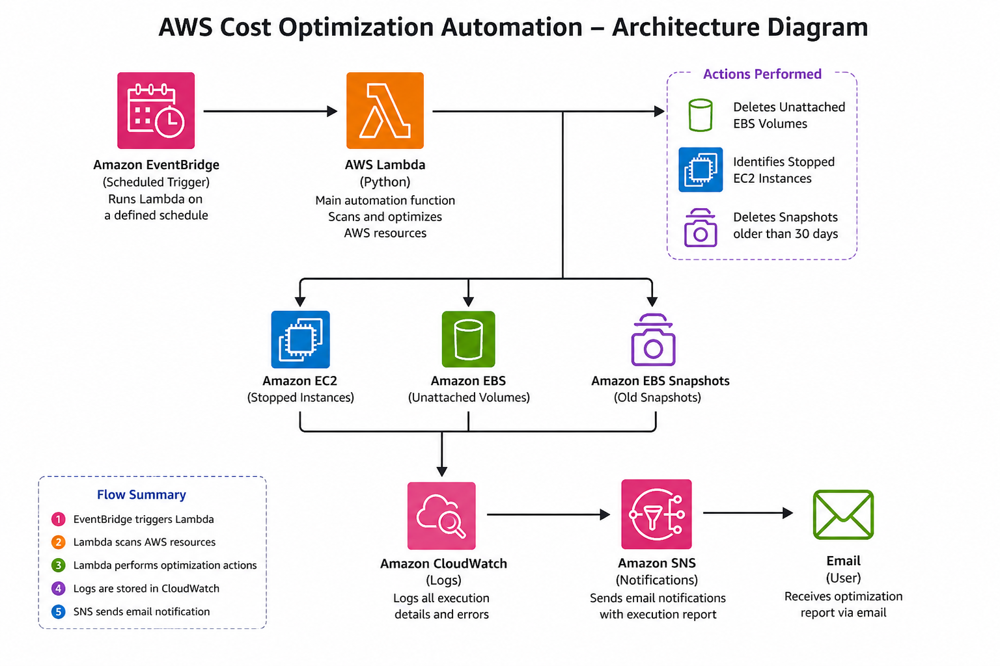

# AWS Cost Optimization Automation using AWS Lambda



## 📌 Project Overview

AWS Cost Optimization Automation is a serverless AWS project developed using Python and AWS Lambda to automatically identify and clean up unused cloud resources that contribute to unnecessary AWS costs.

The solution performs automated cost optimization by scanning AWS resources, deleting unattached Amazon EBS volumes, identifying stopped Amazon EC2 instances, removing EBS snapshots older than 30 days, sending email notifications through Amazon SNS, and logging every execution in Amazon CloudWatch.

The Lambda function is triggered automatically using Amazon EventBridge, eliminating the need for manual execution.

---

# 🚀 Architecture

The following architecture shows the complete workflow of the project.


---

# ✨ Features

- Automated cleanup of unattached EBS volumes
- Detection of stopped EC2 instances
- Automatic deletion of EBS snapshots older than 30 days
- CloudWatch logging for monitoring
- Amazon SNS email notifications
- Automated execution using EventBridge Scheduler
- Serverless architecture
- Built using Python and boto3

---

# 🛠 AWS Services Used

| Service | Purpose |
|----------|----------|
| AWS Lambda | Executes automation script |
| Amazon EC2 | Detects stopped instances |
| Amazon EBS | Deletes unattached volumes |
| Amazon EBS Snapshots | Deletes old snapshots |
| Amazon SNS | Sends email notification |
| Amazon EventBridge | Schedules Lambda execution |
| Amazon CloudWatch | Stores execution logs |
| IAM | Grants required permissions |

---

# 💻 Technologies

- Python 3.x
- boto3
- AWS Lambda
- AWS CLI
- Git
- GitHub

---

# 📂 Project Structure

```
AWS-Cost-Optimization/
│
├── lambda_function.py
├── requirements.txt
├── README.md
├── screenshots/
│   ├── architecture.png
│   ├── lambda-function.png
│   ├── lambda-test.png
│   ├── cloudwatch-logs.png
│   ├── sns-topic.png
│   ├── eventbridge-rule.png
│   └── ec2-instance.png
```

---

# ⚙ Workflow

1. Amazon EventBridge triggers AWS Lambda.
2. Lambda scans AWS resources.
3. Unattached EBS volumes are deleted.
4. Stopped EC2 instances are identified.
5. Snapshots older than 30 days are deleted.
6. CloudWatch logs are generated.
7. Amazon SNS sends an email report.

---

# 📸 Project Screenshots

## AWS Lambda Function


---

## Lambda Test Result


---

## CloudWatch Logs


---

## Amazon SNS


---

## EventBridge Scheduler


---

# 📧 Sample Output

The Lambda function generates:

- Deleted EBS Volumes
- Stopped EC2 Instances
- Deleted Snapshots

A notification email is automatically sent using Amazon SNS.

---

# 📈 Future Enhancements

- Terraform Infrastructure
- GitHub Actions Deployment
- AWS Cost Explorer Integration
- Multi-Region Support
- CSV Report Generation
- Resource Tag Based Filtering

---

# 🎯 Learning Outcomes

Through this project I gained hands-on experience with:

- AWS Lambda
- Amazon EC2
- Amazon EBS
- Amazon EventBridge
- Amazon SNS
- CloudWatch Logs
- IAM Policies
- Python Automation using boto3
- Git & GitHub

---

# 👨‍💻 Author

**Syed Ayaan Jahagirdar**

GitHub: https://github.com/1225ayaan

LinkedIn: *(Add your LinkedIn profile URL here)*

---

# ⭐ If you found this project useful, consider giving it a Star.